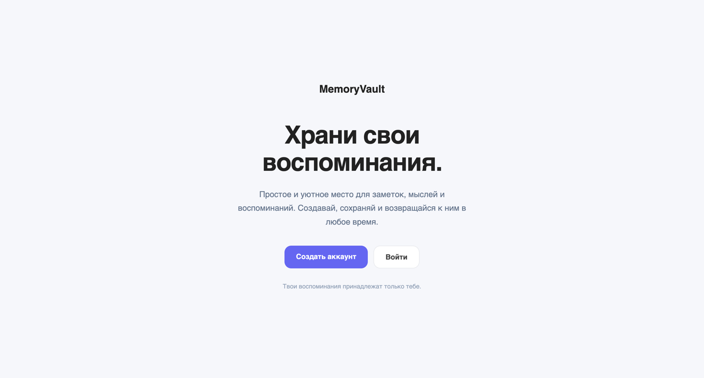
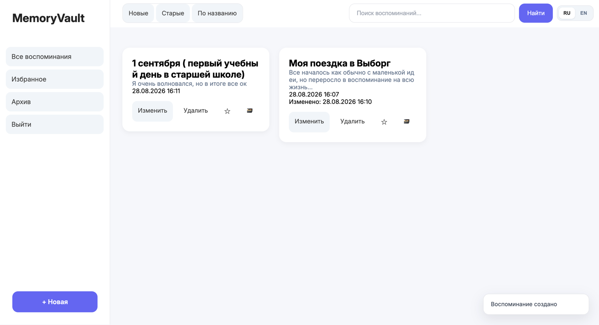
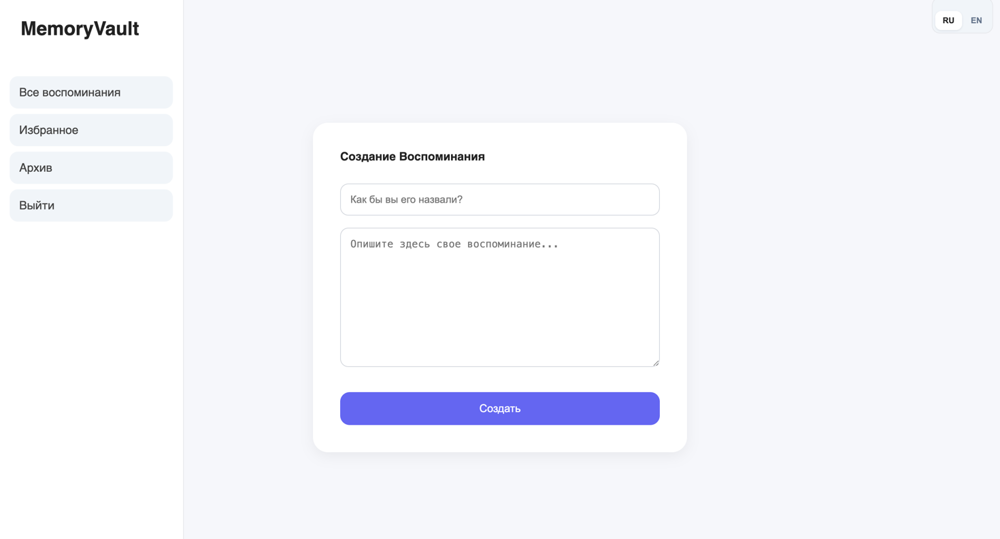
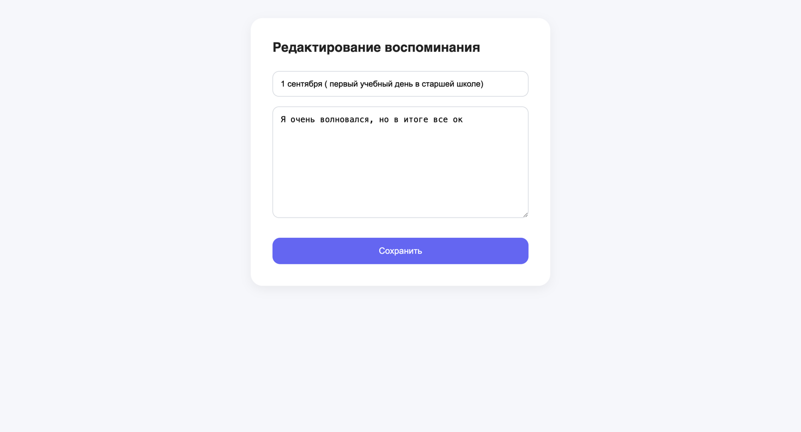

# MemoryVault




MemoryVault — веб-приложение для хранения личных воспоминаний и заметок.

Проект создан на Django в качестве pet-проекта для изучения backend-разработки и работы с Django.

## Возможности

* регистрация и авторизация пользователей
* создание воспоминаний
* редактирование и удаление
* добавление в избранное
* архивирование
* поиск по заметкам
* сортировка заметок
* просмотр полного содержимого воспоминания
* уведомления о действиях пользователя
* переключение русского и английского языка
* тёмная тема

## 🛠 Технологии

* Python
* Django
* SQLite
* HTML
* CSS
* Django Templates
* Django ORM

## 🚀 Запуск проекта

Клонировать репозиторий:

```bash
git clone git@github.com:On1yy/MemoryVault.git
cd MemoryVault
```

Создать виртуальное окружение:

```bash
python -m venv .venv
```

Активировать его:

### macOS / Linux

```bash
source .venv/bin/activate
```

Установить зависимости:

```bash
pip install -r requirements.txt
```

Применить миграции:

```bash
python manage.py migrate
```

Запустить сервер:

```bash
python manage.py runserver
```

После этого открыть:

```text
http://127.0.0.1:8000/
```

## 📌 О проекте

MemoryVault был создан как мой первый полноценный Django-проект.

В процессе разработки я изучил работу с моделями, представлениями, URL-маршрутизацией, формами, аутентификацией пользователей, Django ORM, фильтрацией и поиском, локализацией и Git.

Проект продолжает развиваться по мере изучения backend-разработки.


## 📸 Скриншоты

### Главная страница



### Создание воспоминания



### Редактирование воспоминания



